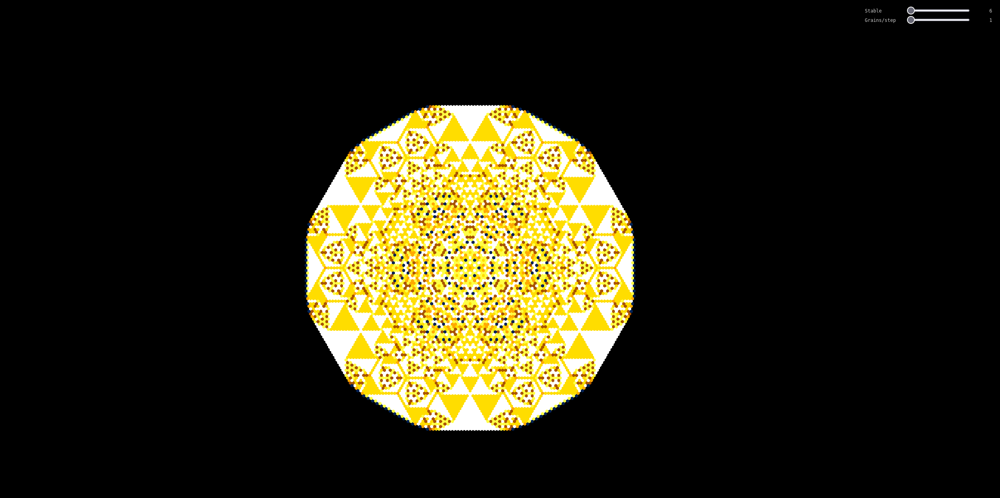

# sandpile

This is a simulation of abelian sandpiles on hexagonal grid.

It's nothing exceptional but it looks fun in motion.



## developing

```
npm run dev
```

## project structure

It's a signle file lol.